<p align="center">
  
</p>

# LLM-Web3-Toolkit

Production-grade Web3 integration framework for Large Language Models. Enables autonomous agents to interact with blockchain infrastructure through standardized function calling interfaces.

## Overview

This toolkit provides cryptographically-secure primitives for LLM-blockchain interaction. Designed for production deployment with enterprise-grade security, multi-chain support, and standardized function schemas compatible with OpenAI, Anthropic, and open-source models.

## Architecture

```
LLM-Web3-Toolkit/
├── packages/
│   ├── core/          # Core Web3 primitives and wallet management
│   ├── chains/        # Multi-chain configuration and adapters
│   ├── functions/     # LLM function calling schemas
│   └── react/         # React components and hooks
├── examples/
│   ├── nextjs/        # Next.js integration
│   ├── node/          # Node.js backend integration
│   └── agents/        # Autonomous agent examples
└── docs/              # Technical documentation
```

## Packages

### @arqon/web3-core
Core blockchain interaction primitives:
- Wallet connection (MetaMask, WalletConnect, Coinbase Wallet)
- Transaction signing and broadcasting
- Multi-chain RPC management
- Gas estimation and optimization
- Event monitoring and indexing

### @arqon/web3-chains
Chain-specific configuration:
- Ethereum mainnet/testnet
- Layer 2 networks (Arbitrum, Optimism, Base)
- Alternative L1s (Polygon, Avalanche, BSC)
- Custom RPC endpoints
- Chain switching and validation

### @arqon/web3-functions
Standardized LLM function schemas:
- OpenAI function calling format
- Anthropic Claude tool schemas
- Universal adapter for custom LLMs
- Parameter validation
- Type-safe execution

### @arqon/web3-react
React integration:
- Wallet connection components
- Transaction confirmation UI
- Balance and address displays
- Network switching
- Error handling

## Security Model

### Transaction Safety
1. All transactions require explicit user approval
2. Gas limits enforced at protocol level
3. Address validation using checksums
4. Simulation before submission
5. Revert protection

### Key Management
- Private keys never exposed to LLM
- Hardware wallet support
- Multi-signature capability
- Session-based permissions

### Network Security
- RPC endpoint rotation
- Rate limiting
- Request signing
- TLS enforcement

## Installation

```bash
npm install @arqon/web3-core @arqon/web3-chains @arqon/web3-functions
```

## Quick Start

```typescript
import { WalletManager } from '@arqon/web3-core';
import { ethereum, arbitrum } from '@arqon/web3-chains';
import { web3Functions } from '@arqon/web3-functions';

// Initialize wallet manager
const wallet = new WalletManager({
  chains: [ethereum, arbitrum],
  defaultChain: ethereum
});

// Connect wallet
await wallet.connect('metamask');

// Execute LLM function
const result = await wallet.executeFunction('get_balance', {});
```

## LLM Integration

### OpenAI Function Calling

```typescript
import { openAIFunctions } from '@arqon/web3-functions/openai';

const completion = await openai.chat.completions.create({
  model: 'gpt-4',
  messages: [{ role: 'user', content: 'What is my ETH balance?' }],
  functions: openAIFunctions,
  function_call: 'auto'
});

if (completion.choices[0].message.function_call) {
  const result = await wallet.executeFunction(
    completion.choices[0].message.function_call.name,
    JSON.parse(completion.choices[0].message.function_call.arguments)
  );
}
```

### Anthropic Claude Tools

```typescript
import { anthropicTools } from '@arqon/web3-functions/anthropic';

const message = await anthropic.messages.create({
  model: 'claude-3-5-sonnet-20241022',
  max_tokens: 1024,
  tools: anthropicTools,
  messages: [{ role: 'user', content: 'Send 0.1 ETH to vitalik.eth' }]
});
```

## Supported Chains

- Ethereum (Mainnet, Sepolia, Holesky)
- Arbitrum One / Nova
- Optimism
- Base
- Polygon
- Avalanche C-Chain
- BNB Smart Chain
- Custom EVM chains

## Function Catalog

### ✅ Production-Ready (32 Functions with Live APIs)

#### Core Wallet & Network (8)
- `get_wallet_address` - Retrieve connected wallet address
- `get_balance` - Query native token balance (ETH/SOL/TRX)
- `get_token_balance` - Query ERC-20 token balance
- `send_native` - Transfer native tokens
- `send_token` - Transfer ERC-20 tokens
- `validate_address` - Verify address format (EVM/Solana/Tron)
- `get_gas_price` - Query current gas pricing
- `switch_chain` - Change active blockchain network

#### Transaction & Contract Analysis (8)
- `get_transaction_history` - Fetch transaction history for address
- `get_block_info` - Get blockchain block details
- `analyze_contract` - Analyze contract code and type
- `get_token_info` - Get ERC-20 token details (name, symbol, decimals)
- `get_nft_holdings` - Query NFT holdings for address
- `scan_address_risk` - Basic risk assessment for addresses
- `get_network_stats` - Current network statistics
- `resolve_ens` - Resolve ENS names to addresses

#### DeFi Tools (5 with Real APIs)
- `get_token_price` - Live token prices from **CoinGecko**
- `get_portfolio_value` - Portfolio tracking via **Covalent API**
- `get_pool_info` - DEX liquidity pool information
- `get_price_history` - Historical price data (**CoinGecko**)
- `simulate_transaction` - Simulate transactions before execution

#### NFT Tools (4 with Real APIs)
- `get_nft_floor_price` - NFT floor prices via **Reservoir API**
- `get_nft_metadata` - NFT token metadata (**Reservoir**)
- `get_collection_stats` - Collection statistics (**Reservoir**)
- `estimate_gas_optimized` - Optimized gas estimation

#### Security & Analytics (2)
- `get_contract_events` - Query contract event logs
- `scan_contract_vulnerabilities` - Basic vulnerability scanning

#### Cross-Chain (1)
- `get_multichain_balance` - Multi-chain balance via **Covalent**

#### DAO Governance (2 with Real APIs)
- `get_dao_proposals` - DAO proposals via **Snapshot API**
- `get_voting_power` - Token voting power (**Snapshot**)

#### Advanced Features (2)
- `simulate_transaction` - Transaction simulation
- `estimate_gas_optimized` - Gas optimization recommendations

## Development

```bash
# Install dependencies
npm install

# Build all packages
npm run build

# Run tests
npm run test

# Development mode
npm run dev
```

## Testing

Comprehensive test suite covering:
- Unit tests for all functions
- Integration tests with testnets
- E2E tests with LLM providers
- Security audit tests
- Gas optimization tests

## Documentation

Detailed documentation available in `/docs`:
- Architecture overview
- API reference
- Security best practices
- Chain integration guide
- LLM provider integration
- Example implementations

## License

Apache-2.0

## Security

Security disclosures: security@arqon.ai

All production deployments should:
1. Use hardware wallets for high-value operations
2. Implement rate limiting
3. Enable transaction simulation
4. Maintain audit logs
5. Use dedicated RPC endpoints

## Roadmap

### Phase 1: Core Infrastructure (Current)
- MetaMask integration
- Multi-chain support
- Basic function calling
- OpenAI/Anthropic schemas

### Phase 2: Advanced Features
- Hardware wallet support
- Multi-signature operations
- Batch transaction execution
- Gas optimization strategies

### Phase 3: Enterprise Features
- Role-based access control
- Transaction queuing
- Advanced monitoring
- Compliance reporting

### Phase 4: DeFi Integration
- DEX aggregation
- Lending protocols
- Yield optimization
- Portfolio management

## Contributing

Contributions welcome. See CONTRIBUTING.md for guidelines.

## Support

- Documentation: https://docs.arqon.ai/llm-web3-toolkit
- Issues: https://github.com/ArqonAi/LLM-Web3-Toolkit/issues
